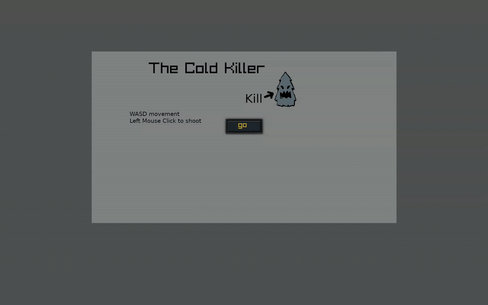

brackeysGameJam  
https://itch.io/jam/brackeys-13  
theme: 
Nothing can go wrong...

build & run:

for linux, just build.
- remember to enable "Executable as Program" option for the executable.

for windows, do ..  
export PATH="/home/gwk/go/go1.24.0/bin:$PATH"
CGO_ENABLED=1 CC=x86_64-w64-mingw32-gcc GOOS=windows GOARCH=amd64 go build -ldflags "-s -w"

play gif:  

# Game dev considerations 

  
## Choosing programming language
### Requirements
1. Not handling hardware compatibility by myself. Option to use language feature to compile into other operating systems
2. Has jobs
3. Simple in nature
4. I enjoy writing the language

candidates: Go, Zig, Rust, C
- I really like C but not wish to handle all the compatibility fuss in 2025
- Zig is strong in every way but has no job market at the moment
- I do not enjoy writing Rust

hence, Go.

## Choosing framework
candidates: Godot, Unreal, Unity, Raylib, SDL or Building everything by myself
- I want to go somewhat low level to learn things
- But not lower to handle compatibility hell

hence, Raylib

## Things I gave up implementing
- Web assembly support. the tech is not mature enough and just too much work.
- Mac support. I do not own a Mac.

## Lesson learned
- Separation of concerns is king. All dependency must be separated.
- Completing something is important. One misses a lot by not completing a project out.
- No tool is perfect.

## Future goals
- Full 3D game.
- Game on steam.
- Might use different stack. Java/Kotlin + LibGDX looks good.
